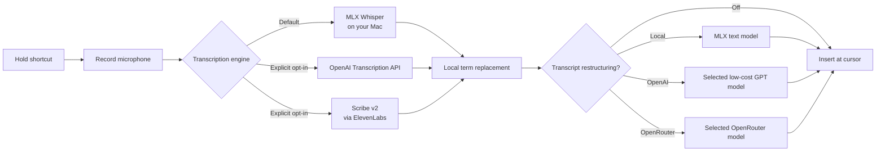

<p align="center">
  
</p>

<h1 align="center">Red Whisper</h1>

<p align="center">
  <strong>Open-source macOS dictation. Bring your own API key—or stay fully local.</strong><br>
  Hold your shortcut, speak naturally, and release. Red Whisper transcribes,<br>
  optionally restructures, and inserts your words at the active cursor.
</p>

<p align="center">
  
  
  
  
  
  
  <a href="LICENSE"></a>
</p>

<p align="center">
  <a href="#the-open-source-byok-alternative">Why Red Whisper</a> ·
  <a href="#install">Install</a> ·
  <a href="#using-red-whisper">Usage</a> ·
  <a href="#transcription-engines">Engines</a> ·
  <a href="#privacy">Privacy</a> ·
  <a href="#development">Development</a>
</p>

---

Red Whisper is an open-source, native macOS menu-bar application for people who
want system-wide voice dictation without giving up control of their audio or
transcription pipeline. Its default engine runs Whisper Large v3 Turbo locally
through Apple MLX. OpenAI and ElevenLabs transcription, plus local, OpenAI, and
OpenRouter restructuring, are available only when explicitly enabled.

```text
Hold shortcut  →  Speak  →  Release  →  Transcribe  →  Restructure (optional)  →  Insert
```

## The open-source BYOK alternative

Red Whisper is free and MIT-licensed. It does not require a Red Whisper account,
hosted service, or recurring app subscription. Use the included local Whisper
engine at no per-recording API cost, or bring your own OpenAI, ElevenLabs, or
OpenRouter API key when a cloud model suits the job better.

This approach removes the extra software-subscription layer: cloud usage is
billed directly by the provider you choose, at that provider's published rate,
without a Red Whisper markup. You can switch models, use a free OpenRouter model
when available, keep restructuring local, or turn cloud features off entirely.

| Typical paid dictation service | Red Whisper |
|---|---|
| Recurring app subscription | No Red Whisper subscription |
| Vendor-selected transcription pipeline | Local Whisper or your chosen cloud provider |
| Bundled usage and service markup | Bring your own key and pay the provider directly |
| Closed feature roadmap | MIT-licensed source that can be inspected and changed |
| Cloud processing may be required | Local transcription and restructuring are available |
| One fixed shortcut or microphone path | Configurable shortcuts, microphones, and sensitivity |

> [!NOTE]
> Bring-your-own-key does not make paid APIs free. OpenAI, ElevenLabs, and
> OpenRouter charge the account associated with your key, and their prices,
> quotas, and free-model availability can change. Your savings depend on usage
> and model choice; local mode avoids provider request charges.

## Why Red Whisper

### Use a ChatGPT subscription for rephrasing

Transcription and rephrasing have separate provider settings. You can keep
OpenAI or ElevenLabs API transcription and use an eligible ChatGPT Plus or Pro
plan for the text-rephrasing step:

1. Open **RedWhisper → Settings → ChatGPT account…**.
2. Click **Continue with ChatGPT** and approve **Use your ChatGPT plan** in your browser.
3. Return to Settings, select **ChatGPT subscription** under Restructuring,
   select a model, and click **Save Settings**. Leave your transcription choice unchanged.

The model picker synchronizes the connected account's entire user-visible model
catalog after sign-in, account switching, and opening Settings. **Refresh models**
forces an update; active rewriting refreshes a catalog older than one hour.
**Automatic** follows the first model in OpenAI's account catalog order. An
explicitly selected model that disappears is marked unavailable, not silently
replaced. This lists models available through the integration, which can differ
from ChatGPT's own model picker.

OAuth credentials are stored separately from API keys in macOS Keychain. The
subscription route sends transcript text, not audio, to the public Responses API.
It consumes your existing plan allowance; use **Manage usage** to control app
limits. If sign-in, quota, or rewriting fails, RedWhisper keeps the original
transcript and reports a warning. It never falls back to paid API rephrasing.
**Disconnect** clears local credentials and attempts remote session revocation.

Account linking requires your own browser approval. API transcription remains
separately billed, and subscription eligibility is determined by OpenAI.
See [Sign in with ChatGPT](https://developers.openai.com/siwc/quickstart) and
[supported capabilities](https://developers.openai.com/siwc/token-sharing-open-source/preview-limitations).

The optional launch-time browser form can use a previously connected account;
account linking and switching are managed in the native Settings window.

| Capability | What it means |
|---|---|
| **No app subscription** | Install the open-source app and choose whether any provider usage is worth paying for. |
| **Bring your own key** | Connect OpenAI, ElevenLabs, or OpenRouter directly; Red Whisper does not resell or mark up requests. |
| **Private by default** | Local MLX transcription keeps recordings and transcripts on your Mac. |
| **Works across macOS** | Dictate into any application that accepts pasted text. |
| **True push-to-talk** | Recording runs only while your configured shortcut is held. |
| **Native controls** | Configure and quit Red Whisper from its menu-bar ear icon—no browser required. |
| **Flexible audio input** | Select built-in, USB, virtual, or Bluetooth microphones and tune sensitivity. |
| **Optional polished prose** | Restructure transcripts locally or through OpenAI/OpenRouter without turning dictation into a chatbot. |

### Highlights

- Local `mlx-community/whisper-large-v3-turbo` transcription by default
- OpenAI file-transcription models, including the recommended `gpt-transcribe`
- ElevenLabs `scribe_v2`, `scribe_v2_realtime`, and legacy `scribe_v1` transcription
- Configurable primary and secondary push-to-talk shortcuts
- Support for single modifier keys, including Fn/Globe, Control, and Option
- Compact liquid-glass recording island with a subtle live waveform and timer
- Live microphone discovery, including Bluetooth devices connected after launch
- Selectable microphone sensitivity with safe digital gain
- Optional best-of-five maximum-accuracy decoding for the local model
- Deterministic, case-insensitive local term replacement
- Optional local MLX-LM sentence and paragraph restructuring
- Low-cost OpenAI transcript restructuring with GPT-5 Nano by default
- OpenRouter transcript restructuring with a separate key and selectable model
- Casual restructuring by default; begin with `professional` to switch tone
- Rewrite safeguards preserve the speaker's intent and reject assistant-style replies
- Persistent settings and separate OpenAI/OpenRouter/ElevenLabs key storage in macOS Keychain
- No transcript logging, telemetry, or cloud dependency in the default mode

## How it works



The transcription engine and writing stage are independent. Choosing GPT-4o or
Scribe v2 does not automatically enable rewriting. Local restructuring stays on
the Mac. OpenAI and OpenRouter restructuring send only the transcript and make
one additional provider request per recording.

## Requirements

- macOS 13 or later
- Apple Silicon Mac (M1 or newer)
- Python 3.10 or later
- [Homebrew](https://brew.sh/) for automatic PortAudio installation
- Approximately 1.6 GB for the default Whisper model, plus Python dependencies
- Microphone and Accessibility permission for `RedWhisper.app`

Intel Macs are not supported because the local inference path depends on MLX.

## Install

Clone the repository and run the installer:

```bash
git clone https://github.com/redoyan/RedWhisper.git
cd RedWhisper
chmod +x install.sh
./install.sh
```

The installer creates an isolated virtual environment, installs PortAudio when
Homebrew is available, downloads Whisper Large v3 Turbo, and prepares the
private runtime inside `RedWhisper.app`.

To install the optional local professional-restructuring model support:

```bash
./install.sh --with-local-llm
```

Then launch the application:

```bash
open RedWhisper.app
```

You can also double-click **RedWhisper.app** in Finder. It runs quietly in the
background and places a native ear icon in the macOS menu bar; Terminal does not
remain open.

### Quick start

1. Launch **RedWhisper.app** and grant Microphone and Accessibility permission.
2. Click the ear icon in the macOS menu bar and open **Settings…**.
3. Select the microphone you want Red Whisper to use.
4. Click the primary or secondary shortcut field and press your preferred key.
5. Keep **Whisper Large v3 Turbo — Local** selected for key-free local use, or
   choose a cloud engine and paste your own provider key.
6. Save, hold the shortcut while speaking, and release it to insert the text at
   the active cursor.

Provider keys are saved in macOS Keychain, so they do not need to be entered
again after restarting the app.

> [!IMPORTANT]
> The current application bundle is unsigned. A broadly distributed binary
> release will require Apple code signing and notarization. Building from source
> with the installer is the supported setup path today.

### Grant macOS permissions

On first launch, allow Red Whisper under:

1. **System Settings → Privacy & Security → Microphone**
2. **System Settings → Privacy & Security → Accessibility**

Microphone permission allows audio capture. Accessibility permission allows the
global shortcut and insertion of the completed transcript at the active cursor.

## Using Red Whisper

1. Click the Red Whisper ear icon in the menu bar.
2. Open **Settings…** and choose a transcription engine and microphone.
3. Click a shortcut field, then press the key or key combination you want.
4. Save the settings.
5. Hold the shortcut while speaking, then release it to transcribe and insert.

Text fields support the standard macOS Command-C/Command-V shortcuts as well as
Control-C/Control-V. This includes API-key, language, replacement-path, and
editable model fields.

The default shortcut is **Fn/Globe**. A secondary shortcut can be assigned for
an external keyboard or docking-station setup. Shortcut fields capture the key
you press; they are not limited to a fixed preset list in the native settings
window.

While recording, a small translucent liquid-glass island appears near the
bottom center of the active screen. Its slim, warm-toned waveform follows the
live microphone level while a timer shows elapsed recording time. The island
contains no instructions and disappears immediately on release while
transcription continues in the background.

The menu-bar menu also provides:

- **Start Recording / Stop Recording** for mouse-driven capture
- **Settings…** for changing the saved configuration while the app is running
- **Quit RedWhisper** for stopping capture and terminating the background app

Saving settings restarts the worker unobtrusively so the new engine, model,
microphone, and shortcuts take effect without launching a second instance.

## Transcription engines

| Engine | Processing location | Best for | Tradeoff |
|---|---|---|---|
| **Whisper Large v3 Turbo** | Local Apple Silicon GPU | Privacy and offline dictation | Uses local memory and compute |
| **GPT Transcribe** | OpenAI API | Recommended general-purpose cloud transcription | Sends each recording to OpenAI |
| **GPT-4o Mini Transcribe** | OpenAI API | Faster cloud transcription | Sends each recording to OpenAI |
| **GPT-4o Transcribe** | OpenAI API | Maximum cloud accuracy | Sends each recording to OpenAI |
| **GPT-4o Transcribe Diarize** | OpenAI API | Speaker-aware transcription | Sends each recording to OpenAI |
| **Whisper-1** | OpenAI API | Legacy timestamps and formats | Sends each recording to OpenAI |
| **ElevenLabs Scribe v2** | ElevenLabs API | High-accuracy multilingual transcription | Sends each recording to ElevenLabs |
| **ElevenLabs Scribe v2 Realtime** | ElevenLabs WebSocket API | Streaming transcription after release | Sends each recording to ElevenLabs |
| **ElevenLabs Scribe v1** | ElevenLabs API | Legacy compatibility | Sends each recording to ElevenLabs |

### Local MLX Whisper

The default local path uses
[`mlx-community/whisper-large-v3-turbo`](https://huggingface.co/mlx-community/whisper-large-v3-turbo).
English is selected by default to avoid an extra language-detection pass; choose
`auto` in Settings for multilingual detection.

**Maximum local accuracy** generates five decoding candidates and keeps the
highest-scoring result. It can improve ambiguous passages but increases GPU work
and latency. It cannot recover clipped audio or compensate for an unsuitable
microphone.

A short 16 GB Apple Silicon test reached about 1.84 GB maximum resident memory
and a 2.70 GB peak memory footprint. Treat **about 3 GB** as a practical
estimate, not a guarantee; recording length, macOS version, and enabled options
all affect resource use.

### OpenAI transcription

Choose an OpenAI file-transcription model in Settings and enter an API key. Red Whisper stores
the key in **macOS Keychain**, never in `settings.json` or the repository. Once
saved, the key persists across restarts and can be replaced from Settings.

`gpt-transcribe` is the recommended default for new recorded-audio workflows.
The diarization model automatically requests speaker-labelled JSON, while
`whisper-1` remains available for legacy compatibility.

OpenAI API usage is billed through the API Platform account associated with the
key. A ChatGPT Plus, Pro, Business, or Enterprise subscription is not used as
Red Whisper API credit.

An environment variable takes precedence for terminal-based use:

```bash
export OPENAI_API_KEY="your-key"
./start.sh --engine openai --language en
```

Never place an API key in this repository or in `replacements.json`.

### ElevenLabs Scribe

Choose **Scribe v2**, **Scribe v2 Realtime**, or legacy **Scribe v1** in
Settings and enter an ElevenLabs API key.
The key is stored separately in macOS Keychain and persists across restarts.
Red Whisper uploads the completed WAV recording to ElevenLabs only when this
engine is selected, requests clean text without audio-event tags, and then runs
the same local replacements and optional restructuring pipeline used by the
other transcription engines.

Scribe v2 supports multilingual transcription and automatic language detection.
The app maps its default `en` setting to ElevenLabs' documented `eng` language
code; select `auto` to let Scribe detect the language.

Scribe v2 Realtime uses ElevenLabs' speech-to-text WebSocket endpoint. Red
Whisper records locally while the shortcut is held, then streams the completed
16 kHz PCM recording after release so the existing push-to-talk, silence guard,
local replacements, and optional restructuring behavior remain consistent.

All models explicitly documented by ElevenLabs as speech-to-text are included.
The general model-list endpoint also returns text-to-speech, voice-conversion,
music, and sound-generation models without an STT capability flag, so Red
Whisper does not populate this selector from that response. In particular,
`eleven_v3` is a text-to-speech model and is intentionally excluded.

```bash
export ELEVENLABS_API_KEY="your-key"
./start.sh --engine elevenlabs --elevenlabs-model scribe_v2 --language en
```

## Transcript restructuring

The local option passes the transcript through
`mlx-community/Llama-3.2-3B-Instruct-4bit` on the Mac. The model corrects grammar
and punctuation, removes filler and false starts, and reorganizes spoken
phrasing into coherent professional prose.

All restructuring options produce natural, casual message-style writing by
default. Say **professional** as the first word of a recording to produce
professional prose for that recording; the command word is removed before the
finished text is inserted.

The OpenAI option defaults to **GPT-5 Nano**, the least expensive general text
model in the available selector. GPT-5 Mini and higher-quality GPT-5.6 tiers
remain available when a difficult transcript needs more capability. The local
Llama 3B option has no per-request charge and keeps the transcript on the Mac.

The OpenRouter option uses its own API key and model field. Its default model,
`openrouter/free`, routes each request to an available free model. You can also
enter a specific OpenRouter model ID; free variants conventionally end in
`:free`. The model control is an editable dropdown: every successfully saved
model ID remains available for selection after the app restarts. Free-model
availability and rate limits are controlled by OpenRouter, so they can vary over
time.

`gpt-oss-120b` is not included as a local option because it requires at least
about 60 GB of accelerator memory. Even `gpt-oss-20b` requires around 16 GB
before Whisper and application overhead, making both poor fits for a 16 GB Mac.

The rewrite prompt treats speech strictly as source text—not as a request to an
assistant. It requests exactly one finished rewrite with no alternatives,
labels, commentary, or explanations. Questions remain questions, and safeguards
reject reply-like, multi-version, implausibly short, or invented output. Because
this is still a generative stage, review important text before sending it.

The local model is loaded and warmed during startup when the feature is enabled,
avoiding a first-dictation download or initialization delay. It adds its own
memory use and latency. Cloud restructuring avoids that local model load but
sends the transcript to the selected provider and may incur a separate API
charge.

## Microphones and Bluetooth audio

The native settings window lists every Core Audio device that provides an input
channel. This includes built-in microphones, USB interfaces, virtual inputs, and
Bluetooth headsets in microphone mode.

While Settings is open, Red Whisper refreshes the device list automatically and
resets PortAudio's cached enumeration after connection changes. A newly
connected Bluetooth microphone therefore appears without relaunching the app.
The saved device name is restored even if macOS assigns it a different numeric
index after reconnection.

Output-only Bluetooth profiles are intentionally omitted because they cannot
record audio. If a headset exposes separate input and output entries, select its
input-capable entry under **Microphone**.

Sensitivity options apply 1×, 2×, 4×, or 8× digital gain with clipping
protection. Gain can help a quiet signal, but selecting the correct physical
input is preferable to amplifying the wrong device.

## Local term replacement

Term replacement is deterministic, offline, and does not use an LLM. Copy the
example file and add project names, people, acronyms, or specialized vocabulary:

```bash
cp replacements.example.json replacements.json
```

Example:

```json
{
  "red whisper": "Red Whisper",
  "mlx": "MLX",
  "open ai": "OpenAI"
}
```

Then select the file in Settings or launch with:

```bash
./start.sh --replacements replacements.json
```

Keys are matched case-insensitively, with longer phrases replaced first. Values
are inserted exactly as written.

## Privacy

| Configuration | Audio sent off the Mac | Transcript sent off the Mac |
|---|---:|---:|
| Local Whisper | No | No |
| Local Whisper + replacements | No | No |
| Local Whisper + local restructuring | No | No |
| Any OpenAI transcription model | Yes, to OpenAI | Only with cloud restructuring |
| Any ElevenLabs Scribe model | Yes, to ElevenLabs | Only with cloud restructuring |
| Local transcription + OpenAI restructuring | No | Yes, to OpenAI |
| Local transcription + OpenRouter restructuring | No | Yes, to OpenRouter |

Temporary recordings use private randomized filenames and are deleted after
processing. Dictated text is not printed to the terminal or written to a
transcript history, and Red Whisper includes no application telemetry.

When cloud transcription is selected, the chosen OpenAI or ElevenLabs data
handling terms apply to the audio request. Cloud restructuring separately sends
the resulting transcript to the selected OpenAI or OpenRouter provider; local
replacements and local restructuring remain on the Mac.

## Settings and files

Non-secret settings are saved atomically with user-only permissions at:

```text
~/Library/Application Support/RedWhisper/settings.json
```

The OpenAI, OpenRouter, and ElevenLabs API keys are stored as separate entries
in macOS Keychain. For terminal use, `OPENAI_API_KEY`, `OPENROUTER_API_KEY`, and
`ELEVENLABS_API_KEY` environment variables take precedence. Diagnostic logs are
available at:

```text
~/Library/Logs/RedWhisper/app.log
```

The log contains startup, model, timing, and error information—not dictated
text.

## Public-repository safety

- API keys are stored in macOS Keychain and are not part of saved app settings.
- Local settings, environment files, logs, audio, transcripts, replacement
  dictionaries, and common credential-file formats are excluded by
  [`.gitignore`](.gitignore).
- Every push and pull request runs a Gitleaks scan.
- Real keys and personal dictation must never be used in tests, examples, issues,
  or pull requests.

If a key is ever committed, revoke it immediately. Deleting it in a later commit
does not remove it from Git history. Follow the private reporting and cleanup
instructions in [SECURITY.md](SECURITY.md).

## Command-line diagnostics

`start.sh` is generated by the installer and remains available for debugging or
automation. The normal user experience is the menu-bar application.

```bash
# Show all options
./start.sh --help

# List Core Audio devices
./start.sh --list-devices

# Use automatic language detection
./start.sh --no-launch-gui --language auto

# Use slower local best-of-five decoding
./start.sh --no-launch-gui --maximum-accuracy

# Select an input device by Core Audio index
./start.sh --no-launch-gui --input-device 1

# Use GPT-4o Mini Transcribe
./start.sh --no-launch-gui --engine openai \
  --openai-model gpt-4o-mini-transcribe

# Use the recommended OpenAI file-transcription model
./start.sh --no-launch-gui --engine openai \
  --openai-model gpt-transcribe

# Use ElevenLabs Scribe v2
./start.sh --no-launch-gui --engine elevenlabs \
  --elevenlabs-model scribe_v2

# Use ElevenLabs Scribe v2 Realtime
./start.sh --no-launch-gui --engine elevenlabs \
  --elevenlabs-model scribe_v2_realtime

# Combine local accuracy, replacements, and local restructuring
./start.sh --no-launch-gui \
  --maximum-accuracy \
  --replacements replacements.json \
  --post-process-local

# Keep audio local and restructure the transcript cheaply through OpenAI
# Begin a recording with "professional" to switch that recording's tone
./start.sh --no-launch-gui \
  --post-process-openai \
  --openai-rewrite-model gpt-5-nano

# Keep audio local and route restructuring to an available free OpenRouter model
./start.sh --no-launch-gui \
  --post-process-openrouter \
  --openrouter-model openrouter/free
```

Running `./start.sh` without `--no-launch-gui` opens the legacy local browser
configuration page. The native **Settings…** window is used by `RedWhisper.app`.

## Troubleshooting

### The shortcut does not respond

Confirm that **RedWhisper** is enabled in **System Settings → Privacy & Security
→ Accessibility**. Remove stale entries for older builds if macOS shows more
than one.

### The microphone is missing

Open Settings after connecting the device and wait briefly for the input list
to refresh. Confirm that the device offers a microphone profile in macOS Sound
settings; output-only profiles are not selectable.

### Recording is too quiet

Select the intended microphone first, then raise **Sensitivity** gradually. Very
high gain also amplifies background noise.

### The app does not launch

Inspect the diagnostic log:

```bash
tail -n 100 ~/Library/Logs/RedWhisper/app.log
```

For a source checkout, rerun `./install.sh` if the bundled runtime is missing.

## Development

After installation, activate the virtual environment and run the test suite:

```bash
source .venv/bin/activate
python -m unittest discover -s tests -v
```

After changing application source files, rebuild the private runtime before
launching the app:

```bash
./build_app.sh
open RedWhisper.app
```

The bundled launcher owns the RedWhisper Dock icon while its Python runtime stays
hidden as a menu-bar accessory process. Development output is redirected to
`~/Library/Logs/RedWhisper/app.log`.

## Contributing

Issues and focused pull requests are welcome. Please describe the macOS version,
Apple chip, transcription engine, and microphone involved when reporting audio
or performance problems. Run the full test suite before submitting code.

Do not include recordings, API keys, local settings, or personally identifying
dictation samples in issues or commits.

## Acknowledgements

Red Whisper builds on:

- [VoxTape](https://github.com/eauchs/voxtape), the original application base
- [Apple MLX](https://github.com/ml-explore/mlx) for Apple Silicon inference
- [MLX Whisper](https://github.com/ml-explore/mlx-examples/tree/main/whisper)
- [MLX Community](https://huggingface.co/mlx-community) model conversions

## License

Red Whisper is available under the [MIT License](LICENSE), following the VoxTape
upstream license.
